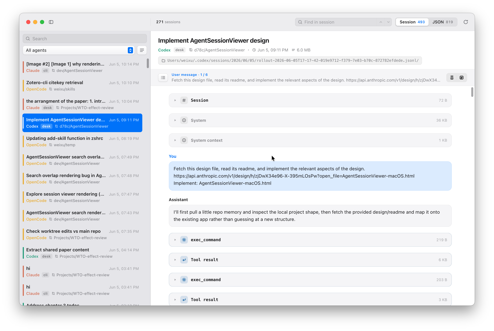

# AgentSessionViewer

A fast viewer of various AI agent sessions.

A lean Electron fork of [Agent Sessions](https://github.com/jazzyalex/agent-sessions), reusing the battle-tested session
parsers from [cli-continues](https://github.com/yigitkonur/cli-continues) (plus a Pi parser ported from [Agent Sessions](https://github.com/jazzyalex/agent-sessions)).

Built because the original stuttered when rendering large transcripts / raw JSONL. This version
parses an **18 MB Codex session in ~33 ms** and a **7.6 MB Claude session in ~16 ms**, then renders
with a windowed (virtualized) list + transcript so only visible rows ever hit the DOM.



## Run

```bash
bun install
bun run dev      # dev with hot reload
bun run build    # production bundles into out/
```

Uses **bun** as the dev/ package manager. The app itself runs on Electron's bundled Node; the system
runtime only matters for scripts and tests. Requires Node ≥ 22 (Electron 35 ships Node 22; SQLite-backed
sources use the built-in `node:sqlite`), and the test suite must run on Node — Bun has no `node:sqlite`.

## Local install & releases

```bash
bun run install:mac   # build in a temporary directory and install to /Applications
```

Release config lives in `electron-builder.yml` (mac dmg arm64/universal, Windows nsis, Linux AppImage; macOS
build is **unsigned** — open via right-click → Open the first time).

CI: `.github/workflows/release.yml` builds on macOS/Windows/Linux and uploads to a GitHub Release when
you push a tag. To cut a release:

```bash
# one-time: git init, create the GitHub repo, git remote add origin …, push
# keep the tag in sync with package.json "version"
git tag v0.1.0 && git push origin v0.1.0
```

The workflow uses the built-in `GITHUB_TOKEN` and auto-detects the repo from the git remote.

## Interface

- **Left** — virtualized list of every local session across all supported agents, with full-text
  search, agent / project filters, and a **Flat / Tree** toggle.
  - Rows show a clean source badge plus a **variant chip**: `cli`, `desk` (desktop app), or `vscode`.
    Claude desktop vs CLI is detected from the session's `entrypoint`; Codex desktop/vscode/cli from
    its `originator`.
  - **Tree** mode nests **subagent** sessions (e.g. `Explore`) under the parent session that spawned
    them. Click the ▶ caret to expand. (Claude subagents live in `<parentUuid>/subagents/agent-*.jsonl`.)
- **Right** — a viewer with two tabs:
  - **Session** — chat-style transcript: user / assistant / thinking / tool calls + results
    (large tool outputs collapse by default).
  - **JSON** — the raw, index-aligned records (the source of truth behind the Session view).
- **Right-click a row** — Copy Resume Command · Copy Session ID · Copy Path · Reveal Session Log
  in Finder · Open Working Directory · Filter by Project.

## Architecture

| Path | Role |
|------|------|
| `src/main/index.ts` | Electron main: BrowserWindow, IPC handlers, native row context menu |
| `src/main/indexer.ts` | Discovers sessions across all 16 tools (`parseSessions`, lightweight) and merges them |
| `src/main/transcript.ts` | Loads a full-fidelity transcript: raw records + normalized display nodes |
| `src/main/mappers/` | Per-source record → node mappers (`claude`, `codex`, `generic` fallback) |
| `src/main/sessions/` | **Vendored** parsers/types/utils from cli-continues (read-only session readers) |
| `src/preload/index.ts` | Context-isolated bridge exposing `window.api` |
| `src/renderer/` | React UI (list, filters, viewer, virtualized Session + JSON views) |
| `src/shared/ipc.ts` | Typed IPC contract shared by main + renderer |

The transcript loader reads raw records itself (rather than cli-continues' `extractContext`, whose
`timeline` is verbosity-truncated and handoff-oriented). Claude and Codex (both JSONL) get dedicated
mappers; SQLite-backed sources (opencode/crush) are reconstructed via the adapter and flagged in the
JSON view.

## Dev harness

`scripts/smoke.ts` indexes real sessions and times transcript loading — runs directly under bun or node:

```bash
bun scripts/smoke.ts
```

## License

MIT.
